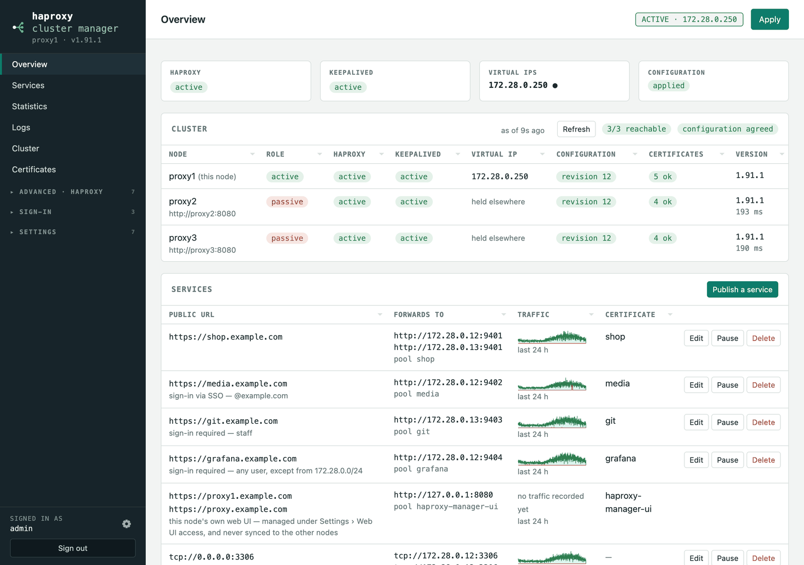

<!-- docs-site:skip -->


> **📖 Documentation: [ham.iothing.net/docs](https://ham.iothing.net/docs/)** — the complete guide: every feature, every setting, and why it works the way it does.
<!-- /docs-site:skip -->

A small self-hosted web UI to manage an **HAProxy** configuration, obtain
**Let's Encrypt** certificates, and run a **cluster of any number of nodes with
Keepalived** on a shared virtual IP — one node active, the rest ready to take
over, with settings and certificates syncing across all of them.

**No database to run — no PostgreSQL, no Redis, no message broker.** The whole
configuration is one JSON file on disk, and a cluster keeps its nodes in step
by syncing that file between them over HTTPS. There is no separate datastore to
install, secure, tune, back up, or keep alive alongside the proxy — which is
the point: the tool that manages your load balancer should not itself be a
stack that needs managing. A backup is one file; moving to new hardware is
copying it across.

```bash
# from a package: .deb and .rpm on every release (Debian, Ubuntu, RHEL, Fedora)
sudo apt-get install -y ./haproxy-manager_1.96.0_all.deb

# or the install script, on any Debian-based server
curl -fsSL https://raw.githubusercontent.com/avandeputte/haproxy-manager/main/install.sh | sudo bash

# or in Docker (linux/amd64 and linux/arm64)
docker run -d --network host --cap-add NET_ADMIN --cap-add NET_BROADCAST --cap-add NET_RAW \
  -v ham-data:/var/lib/haproxy-manager -v ham-acme:/var/lib/acme.sh \
  -v ham-haproxy:/etc/haproxy -v ham-keepalived:/etc/keepalived \
  ghcr.io/avandeputte/haproxy-manager:latest

# or as a Proxmox VE LXC, from the Proxmox host (community-scripts engine)
bash -c "$(curl -fsSL https://raw.githubusercontent.com/avandeputte/haproxy-manager/main/proxmox/ct/haproxy-manager.sh)"
```

Then open `http://<node>:8080`.



<sub>Every screenshot here is the real application, driven by a browser against
a three-node cluster holding made-up data — see
[tools/screenshots](tools/screenshots/).</sub>

This README is the install guide. Everything else — publishing services, certificates,
clustering, sign-in, notifications, Home Assistant, Prometheus, the watchdog, and how it
all works — is at **[ham.iothing.net/docs](https://ham.iothing.net/docs/)**; the same text
lives in [docs/](docs/) here, where it is checked against the code.

## Install

Debian-based distributions (Debian 12/13, Ubuntu 22.04/24.04), on **every** node:

```bash
curl -fsSL https://raw.githubusercontent.com/avandeputte/haproxy-manager/main/install.sh | sudo bash
```

From a checkout, `sudo ./install.sh` installs those files instead of
downloading. If HAProxy Cluster Manager is already installed the same command detects
it and offers to **update**, **remove** (keeping `config.json` and
certificates), **purge** (removing those too), or cancel; piped from `curl`
with no terminal to ask on, it updates in place and says so.

It installs `haproxy`, `keepalived`, `python3-flask`, `python3-requests`,
`python3-waitress`, `openssl`, `socat` and `iproute2` from apt, a pinned
[`acme.sh`](https://github.com/acmesh-official/acme.sh) with no cron of its own
(the manager drives renewals), enables `net.ipv4.ip_nonlocal_bind` so HAProxy
can bind a VIP this node does not hold, creates the administrator and API key,
and installs the systemd unit.

Nothing in HAProxy's configuration is touched until you press Apply. The first
Apply overwrites `/etc/haproxy/haproxy.cfg`, keeping a `.bak`.

**→ [Full installation guide](docs/install-standalone.md)** — every option, what
happens in what order, where each file lives, updating, uninstalling and
troubleshooting.

## Docker

Multi-architecture images (**linux/amd64** and **linux/arm64**) are published to
the GitHub Container Registry:

```bash
docker pull ghcr.io/avandeputte/haproxy-manager:latest   # or :1.46 to pin
docker compose up -d                                     # on every node
```

The image is all-in-one: the manager, HAProxy, Keepalived and `acme.sh` in one
container. There is no systemd inside a container, so `supervisord` runs the
processes and a small `systemctl` shim ([docker/systemctl](docker/systemctl))
translates the calls the app makes. HAProxy runs in master-worker mode and is
reloaded with `SIGUSR2`, so Apply does not drop established connections.

Host networking is the intended mode — Keepalived's VRRP and the virtual IP need
a real interface — and Keepalived needs `NET_ADMIN`, `NET_BROADCAST` and
`NET_RAW`. One container per node.

One thing a container cannot do: **restart a hung manager**. On a systemd host
`WatchdogSec` handles that; supervisord only restarts a process that exits. The
image's `HEALTHCHECK` reports it, but something has to act on that. For a
production cluster, the native install is the better fit.

**→ [Full Docker guide](docs/install-docker.md)** — images and tags, compose,
networking modes, volumes, environment, health, logs, upgrading and limitations.
