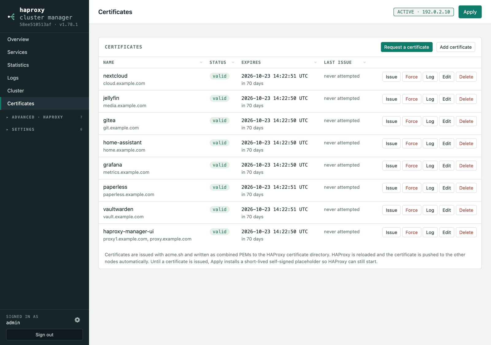

# Certificates

## Reaching the UI over HTTPS

**Settings → Web UI access** publishes this management UI through HAProxy itself,
so it answers at a name you choose:

```
Serve the UI through HAProxy   [x]
Address                        https://proxy.example.com
```

It builds the same objects the publish wizard would — a pool pointing at
`127.0.0.1:8080`, a host rule, the HTTPS listener, an HTTP→HTTPS redirect and a
certificate — and reuses a wildcard that already covers the name. Turning it off
removes them again. A host name already used by another service is refused
rather than quietly stolen from it.

**Set it on each node, with that node's own name.** The setting and everything it
creates are node-local: they are stripped from what a node sends its peers and
preserved when a configuration arrives, so `proxy1` never turns up on the other
nodes. The service appears in the Services list marked as managed, with no Edit
or Delete — change it from this page, or turn it off.

Once it works, set `HAM_LISTEN=127.0.0.1` in the service unit and restart, so the
plain-HTTP port is no longer reachable from anywhere but HAProxy. The page says
so while the UI is still listening on all addresses.

## Requesting a certificate



**Certificates → Request a certificate** asks for the domains and then, for the
two things a certificate needs, lets you either reuse what is already there or
create it in the same step:

- **ACME account** — an existing one, or a new one with its e-mail and CA
  (`letsencrypt_test` issues untrusted certificates with no rate limits, which
  is what you want while setting things up).
- **Challenge type** — an existing one, or a new HTTP-01 or DNS-01.

**Preview** shows exactly which objects will be created or reused before
anything is saved, and *Request it now* runs `acme.sh` immediately and shows its
log. It warns about the mistakes that are otherwise only visible in a failed
issuance: a wildcard with an HTTP-01 challenge (only DNS-01 can validate one), a
DNS-01 challenge with no API hook, and an account with no e-mail address.

### DNS API hooks

The **DNS API hook** field lists every hook the `acme.sh` on this node actually
provides — 191 of them, by provider name — and picking one shows the credentials
it needs, with a button that fills the variable names into the credentials box:

```
CloudFlare needs:
  CF_Key    — API Key
  CF_Email  — Your account email
or instead:
  CF_Token  — API Token
  CF_Account_ID — Account ID
  CF_Zone_ID — Zone ID. Optional.
```

That list is parsed from acme.sh itself rather than hard-coded, so it stays
correct as acme.sh adds providers. The field still accepts anything typed, so an
unknown or newer hook name is passed through unchanged.
