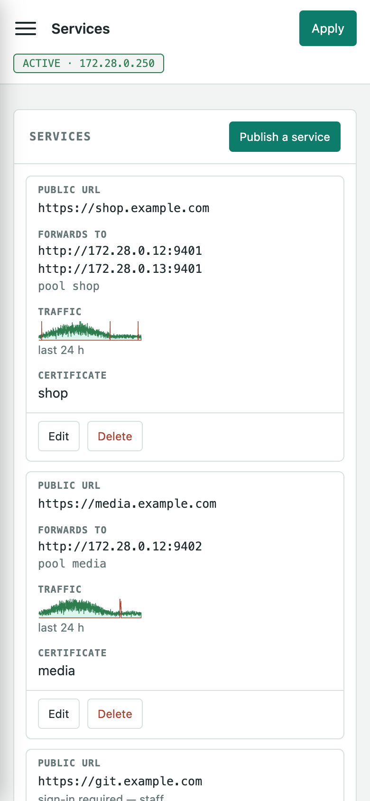
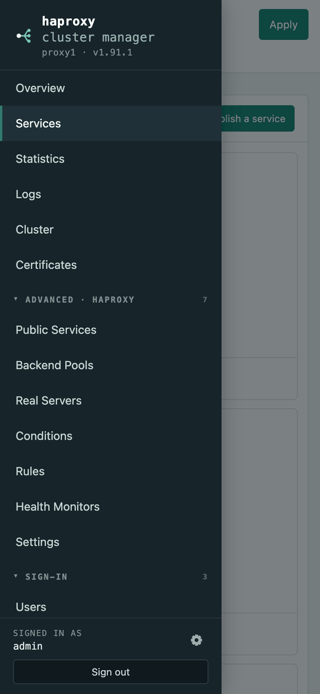

# First run

The first visit asks for a username and password, then offers a setup wizard
with two branches:

- **Join an existing cluster** — point it at any node already running and give
  that node's API key. It registers itself there and that node pushes the
  whole configuration, the cluster settings and the membership list back. You do
  not touch the other nodes.
- **Create a new cluster, or run standalone** — set the virtual IP the nodes will
  share (or skip it and run alone). Other nodes join later by pointing at this
  one.

Either way it ends with this node's API key, which is what the other nodes need
to reach it. "Set this up later" skips straight to the UI.

The gear beside your name at the foot of the menu opens the account dialog:
change the password (optionally applying it to the other nodes), and choose
**Appearance** — *System*, *Light* or *Dark*. *System* follows the operating
system's own light/dark setting and changes with it. The choice is stored with
the node's administrator so it survives a new browser, and also remembered
locally so the page is painted in the right colours before it has asked the
server anything.

## In your language

The interface speaks the language your browser asks for. It reads the
browser's preference list the way any website does and uses the first entry
it has a dictionary for: English, German, French, Spanish, Italian,
Portuguese, Dutch, Swedish, Danish, Norwegian or Finnish. Nothing is stored
and nothing is asked -- change the language in the browser and the next page
load follows.

Everything the UI itself writes is translated: the menu, every page, every
form label and hint, dialogs, confirmations, the login screen, and the fixed
phrases the API answers with ("no such user", "the password is not correct").
What the node's own tools print stays as they print it: the output of
`haproxy -c` and `keepalived -t`, acme.sh logs, and any message the server
assembles around a value it is reporting.

A dictionary is one file, `static/js/i18n/<code>.js`, keyed by the English
string exactly as it appears in the source. `node tools/i18n-check.mjs`
extracts every string the UI can show and refuses a dictionary that is
missing one or drops a placeholder, and `tools/uitests/i18n.mjs` renders
every page and dialog in German and fails on any English left behind -- so
a string added to the source cannot quietly ship untranslated.

## On a phone

The same application, laid out for the screen it is on rather than shrunk to
fit it. Below 840px the menu becomes a drawer behind a button in the bar, which
stays put as the page scrolls; below 680px each row of a table becomes a block
with its column names in front of the values, dialogs take the whole screen,
and fields are large enough that a phone does not zoom in when you tap one.
In between, a table too wide for the screen scrolls inside its own card. The
page itself never scrolls sideways — a phone answers that by zooming the whole
interface out until the widest thing on it fits.

