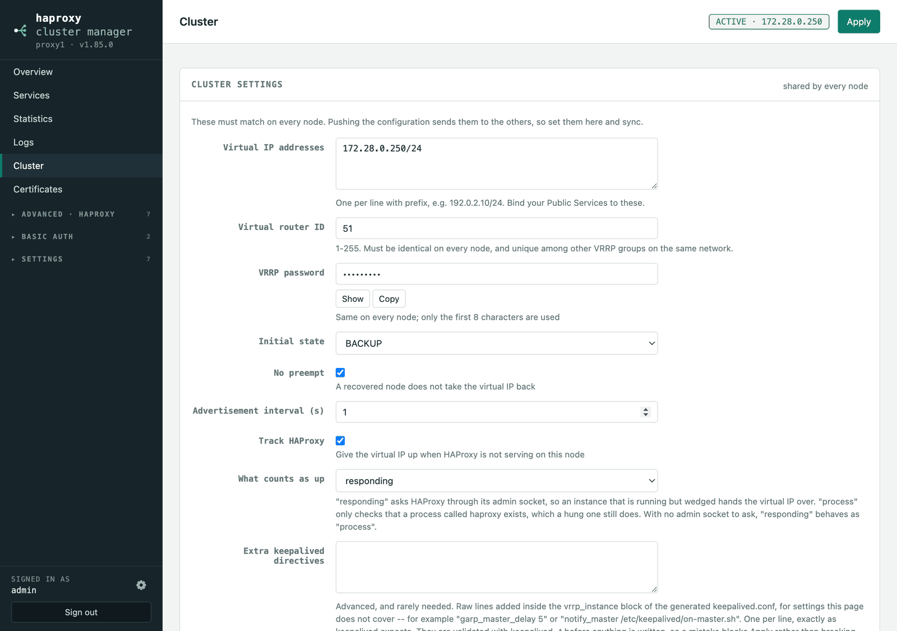

# High availability

Any number of nodes. One holds the virtual IP and serves traffic; the others
stand by with the same configuration, ready to take it.

### Cluster health

**Overview** opens with a **Cluster** table: every node's role, HAProxy and
Keepalived state, which virtual IPs it currently holds, its certificate health,
its version and how long it took to answer. Each node asks the others directly,
in parallel, so the view is live rather than remembered.

It calls out the conditions that are otherwise invisible until traffic stops:

- **No node holds the virtual IP** — nothing is being served on it.
- **Two or more nodes hold it at once** — split brain; they are not seeing each
  other's VRRP.
- Nodes holding an **older configuration** than the rest — see below.
- Nodes with **unapplied changes**, nodes running **different versions**, and
  nodes that **did not answer** (with the reason: unreachable, or the API key
  this node holds for it was rejected).

### What is shared, and what is each node's own

The configuration has two containers, not one container with some objects
marked. The shared sections are what every node has. `local` is what only this
node has — and that includes whole objects, not just settings: the pool,
server, health monitor, rule, conditions and certificate that publish this
node's own management UI live there.

Sharing is therefore a copy rather than a filter: what is sent is the shared
sections as they are, and what is compared is the same value. Nothing has to
decide, on the way past, which objects belong to whom.

A listener is shared while the rule attaching this node's UI to it is not, so
`local.attach` records that by the listener's name — every node has one called
`https-443`, with a different id — and by position, since HAProxy takes the
first matching `use_backend` and serves the first certificate to clients that
send no SNI. Rendering merges the two.

### The nodes agree, or they do not

Reachable is not the same as up to date. A node that was unreachable when a
change was applied keeps the configuration it had, and until it takes the
virtual IP nothing about it looks wrong.

So the shared configuration — everything except node-local settings and the
objects a node owns alone — carries a **revision**: a counter that moves
whenever that configuration changes, and a fingerprint of its contents. Every
node reports both, the Cluster table shows them per node, and the header says
**configuration agreed** or **configuration differs** at a glance.

Three things follow from it:

- **A node that is behind is named**, with the revision it holds and the one
  the cluster is on.
- **A node cannot push a configuration older than the one already there.** An
  isolated node that was edited and then reconnected would otherwise overwrite
  the current configuration with its own; it is refused, with both revisions in
  the message. To discard what is on the other node instead, **Overwrite** on
  the Cluster page lifts this node's revision above every other node's and
  pushes, so they end up on the same configuration and the same revision.
- **It heals itself.** With *Keep the nodes in step* on, the background health
  check already asks every node how it is; any node reporting an older revision
  is brought up to date from the node holding the newest, and a node that has
  just started takes the newest configuration from the cluster before it can
  serve anything stale. Nothing is queued, so nothing is lost — the next round
  observes the same disagreement and acts on it again.

### The Cluster page

Everything about the cluster lives on one page, split by what it applies to:

- **Cluster settings** — the virtual IPs, virtual router ID, VRRP password,
  advertisement interval, initial state, `nopreempt` and HAProxy tracking. These
  must be identical everywhere, so they are part of the shared configuration and
  travel with a push.
- **This node** — whether Keepalived runs here, the interface, this node's
  priority, its unicast addresses, the URL the others should use to reach it, and
  its API key. Never synced: these are meant to differ.
- **Other nodes** — one entry per node with its URL and the API key configured
  *on that node*. A push also hands each node the membership list, including a
  way back to this one, so you maintain the list in one place. Keys are stored
  per peer and never sent back to the browser.
- **This node right now** — the diagnostics described under Keepalived below.

An existing two-node setup is migrated automatically: the old single peer becomes
the first entry, and the shared VRRP settings move out of the node-local section.

### Only the active node is editable

The node holding the virtual IP is where the shared configuration is edited; the
others are **read-only** and show a banner saying so. This stops nodes from
diverging and then overwriting each other on the next push.

A passive node can still fix **itself** — interface, priority, unicast addresses,
peer list, login, API key, updates, and Apply — because a node that cannot take
the VIP has to be repairable. And when *no* node holds the VIP, the banner's
**Edit here anyway** unlocks that node, so a broken cluster is never a lockout.
The lock is enforced by the API, not just hidden in the UI.

The unlock belongs to the sign-in that asked for it: **Lock again** restores it,
and so does signing out or back in. It is not stored, so it cannot be left on by
accident, and another browser signed in to the same node is unaffected.

### Keepalived

- **Keepalived** runs on every node that has a virtual IP configured — it is not
  a per-node switch, so a node cannot sit in a cluster with VRRP quietly off.
  **Unicast addresses are derived** from the node list: each node asks the
  others for the address on their VRRP interface, excluding the virtual IP,
  which is why a DNS name is never used for this. There is nothing to type.
- **Keepalived** runs VRRP on every node with a shared **virtual IP**. Bind your
  Public Services to that VIP. Keepalived's settings are **node-local** — set them
  separately on each node, and they must agree on the **virtual router ID**. For
  non-preempting failover set every node to `BACKUP` with a different priority
  and enable `nopreempt`; the highest-priority node holds the VIP, and a
  recovered node won't yank it back.
- **Tracking HAProxy** decides when a node should give the virtual IP up. The
  default asks HAProxy through its admin socket whether it is serving, so an
  instance that is running but wedged — accepting connections and answering
  none — hands the address to a node that works. The alternative, *process*,
  only checks that something called `haproxy` exists, which a hung one still
  does. The check is a small script written next to `keepalived.conf` by the
  same Apply that writes it, and where there is no admin socket to ask it falls
  back to looking for the process rather than failing a healthy node.
  The **Keepalived** page diagnoses this node: whether the configured interface
  exists, whether the config was written, the VRRP state, and the
  `keepalived -t` output. The state is read from the journal when it is there
  to read — only the journal distinguishes FAULT from BACKUP — and otherwise
  worked out from whether the node holds the virtual IP, with the page saying
  which.
- **Sync** is push-based: the node you edit pushes to the others. A renewed
  certificate is pushed automatically by the node that renewed it.

### Node-local vs. synced

| Synced between nodes | Node-local (never synced) |
|---|---|
| Real Servers, Backend Pools, Public Services | Keepalived (interface, VRID, priority, VIP) |
| Conditions, Rules, Health Monitors | The peer list and their API keys |
| HAProxy Settings | API key |
| ACME accounts, challenges, certificates, automations | Administrator login |
| Deployed certificate PEM files | |
