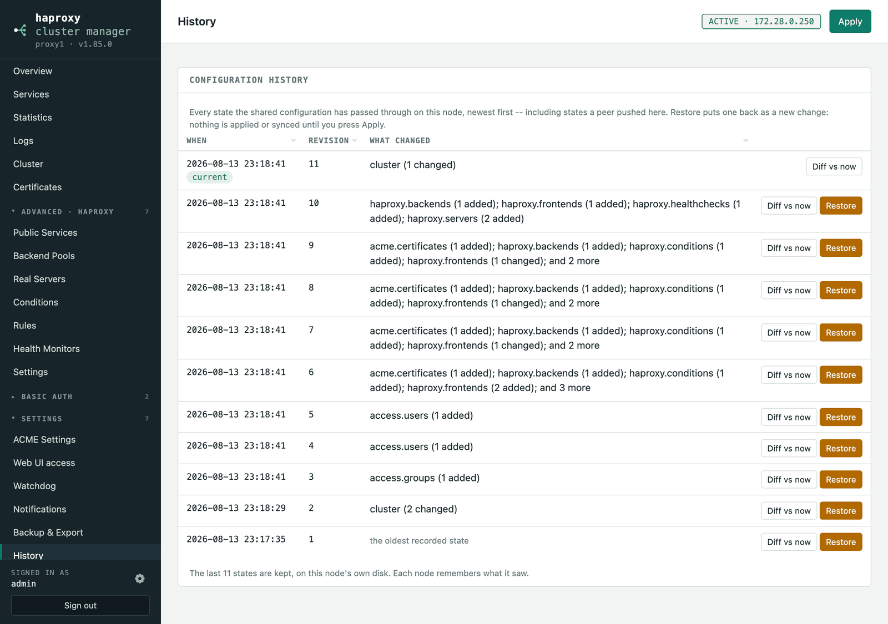

# History & backup

## Configuration history

**Settings → History** lists every state the shared configuration has passed
through on this node — the last 50, newest first, each entry saying what it
changed ("haproxy.backends: 1 added, 1 changed"). A snapshot is taken whenever
the shared configuration actually changes, including when a **peer pushes a
configuration over this node's** — that one deliberately does not count as a
change of this node's own, so counting revisions would miss it, and it is
precisely the case worth being able to undo.

**Diff vs now** names the objects that stand between then and now — added,
removed, or changed — the same way the Cluster page compares two nodes.
**Restore** puts a state back *as a new change*: it takes the next revision
rather than the old one, so the rest of the cluster sees it as the newest
configuration, which happens to have older contents. Nothing is applied or
synced until you press Apply, so the result can be reviewed first. Node-local
settings — Keepalived, the login, the API key — are untouched.

The snapshots live on each node's own disk (`history/` in the data
directory, mode 0600 like the configuration itself); each node remembers what
it saw.

## Backup & Export

**Settings → Backup & Export** covers two different jobs:

- **Generated files** — download the `haproxy.cfg` and `keepalived.conf` this
  configuration renders to, exactly as Apply would write them. Downloading
  changes nothing on the node.
- **Configuration backup** — a JSON file holding everything the UI manages
  (Real Servers, Backend Pools, Public Services, Conditions, Rules, Health
  Monitors, HAProxy Settings, every ACME object, and the users and groups a
  service can ask visitors to sign in with — without their passwords).
  Restoring replaces all of those and leaves node-local settings — Keepalived,
  Sync, the login, the API key — untouched, so the same file can seed a second
  node. A restored user keeps no password, and one already on the node keeps
  the one it has. Nothing is applied until you press **Apply**, so you can
  review the result first.

The backup deliberately contains **no secrets**: no API key, no login, no
private keys from the certificate directory, and no DNS-provider credentials,
EAB keys, or single sign-on client secret. Certificates move between nodes
over Sync, or are re-issued; a restore onto the same node fills the stripped
secrets back in from what is stored, and a restore elsewhere asks for them
again. That makes the file safe to keep off the node.
