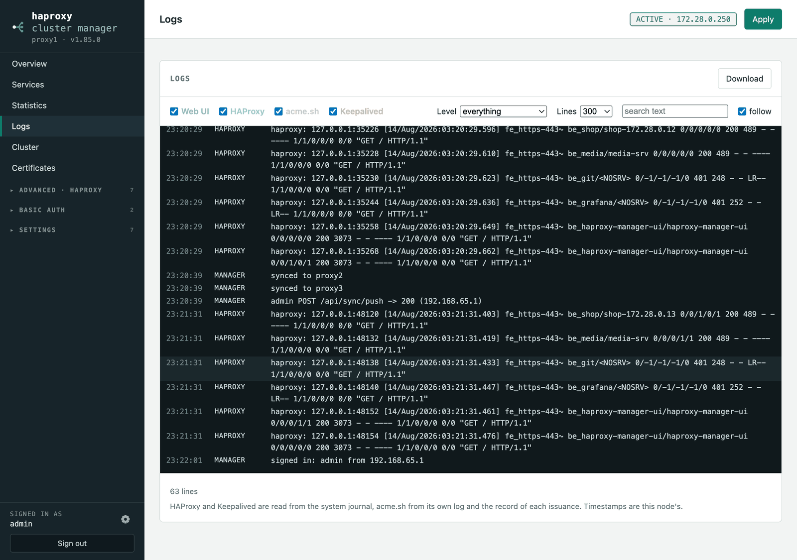

# Logs

**Logs** merges four sources into one timeline, newest at the bottom:

| Source | Where it comes from |
| --- | --- |
| **Web UI** | this app's own log — sign-ins, every configuration change and who made it, apply results, certificate outcomes, sync results |
| **HAProxy** | `journalctl -u haproxy`, falling back to `/var/log/haproxy.log` or `/var/log/syslog` |
| **acme.sh** | acme.sh's own log, plus the recorded outcome of every issuance |
| **Keepalived** | `journalctl -u keepalived`, with the same fallback |

Tick the sources you want, filter by level, search the text, and choose how many
lines to keep. **Follow** re-reads every five seconds and stays pinned to the
bottom; untick it to scroll back without the view jumping. **Download** saves
exactly what you are looking at, filters and all, as plain text.

Timestamps are the node's own, and lines that carry none sort to the end rather
than to 1970. Requests are logged with the object's name but never the request
body, so passwords, API keys and DNS credentials do not reach the log.

The app writes its own log to `/var/lib/haproxy-manager/haproxy-manager.log`
(mode 0600, rotated at 4 MB, three kept) and to standard output, so
`journalctl -u haproxy-manager` shows the same lines.

In the Docker image there is no journal, so a small collector binds `/dev/log`
and tees it to both the container log and `/var/log/ham-syslog.log`, which is
what the viewer reads.
