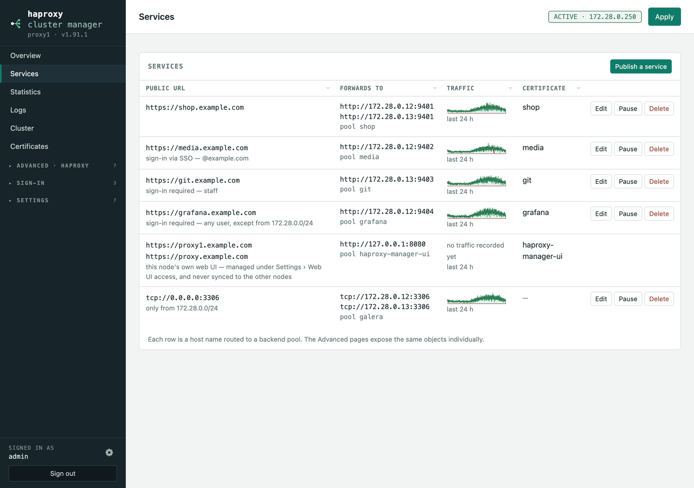
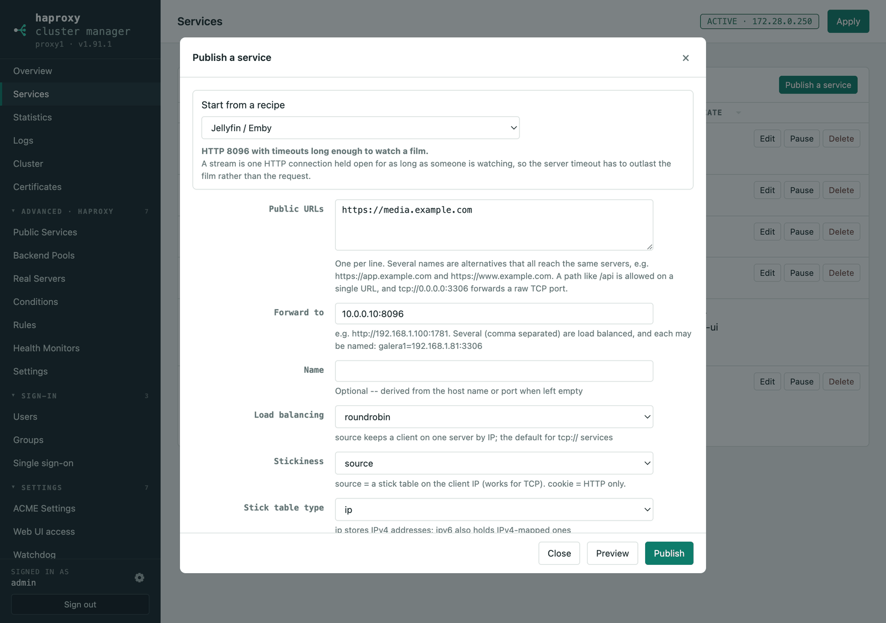

# Publishing a service




Each row is one public name routed to a pool. **Publish a service** opens the
wizard, which can start from a recipe:



The normal way to use this is **Services → Publish a service**: give it the URL
people will visit and the server behind it.

```
Public URL    https://app.example.com
Forward to    http://192.168.1.100:1781
```

From those two lines it creates the Real Server, Backend Pool, host Condition,
routing Rule, the HTTPS listener, an ACME certificate, and an HTTP listener that
redirects to HTTPS — then applies. **Preview** shows exactly what it will create,
and the resulting `haproxy.cfg`, before anything is written.

The form is in sections — Service, Certificate, Health check, Balancing and
timeouts, Allowed networks, Rate limiting, Sign-in, Single sign-on — and each
optional section opens with a checkbox. Unticked, it is off, whatever its
fields still hold, so a limit typed and then unticked is not published.

- **Wildcard certificates are reused, not duplicated.** If a certificate already
  covers the host — `*.example.com` for `app.example.com`, or an exact name —
  the wizard attaches it instead of requesting another one, and says so before
  you commit. An exact name wins over a wildcard that would also match, and
  `*.example.com` correctly does **not** cover `example.com` or
  `a.b.example.com`. Set Certificate to *always request a new certificate* to
  override, or *no certificate* to terminate TLS elsewhere.
- **Several public URLs** on one service: put one per line and every name reaches
  the same servers, as a single rule (`use_backend be_app if acl_host-app or
  acl_host-www`). One certificate covers them all, and adding a name later
  extends it rather than requesting another. Names must agree on scheme and
  port, since they share a listener, and a URL with a path cannot be combined
  with others — a host and a path must both match, while several host names are
  alternatives.
- **Several targets**, comma separated, are load balanced across. Each may be
  named: `galera1=192.168.1.81:3306`.
- **Raw TCP** works too — give it `tcp://0.0.0.0:3306` as the public URL and the
  wizard builds a TCP listener, a TCP-mode pool and the servers. TCP carries no
  host name, so one port serves exactly one pool; publishing a port that is
  already taken is refused rather than silently merged. Load balancing,
  source-IP stickiness (a stick table), health check logging and a separate
  check port are all part of the same form, so this comes out of it:

  ```
  backend be_mariadb_galera_pool
      mode tcp
      balance source
      option mysql-check user haproxy post-41
      option log-health-checks
      stick-table type ip size 50k expire 30m
      stick on src
      server galera1 192.168.1.81:3306 check inter 3s port 3306
      server galera2 192.168.1.82:3306 check inter 3s port 3306
      server galera3 192.168.1.83:3306 check inter 3s port 3306
  ```

  Note `type ip`: that is how HAProxy spells an IPv4 stick table. `type ipv4`
  is rejected outright (`unknown type 'ipv4'`).
- **A health check** can be set up in the same step, and servers that fail it are
  taken out of rotation:

  | Check | What HAProxy does |
  |---|---|
  | ping | opens a TCP connection to the port (HAProxy has no ICMP ping) |
  | HTTP request | `option httpchk`, with a path and an expected status |
  | TLS handshake | `option ssl-hello-chk` |
  | PostgreSQL login | `option pgsql-check` — the login handshake only, no password |
  | MariaDB / MySQL login | `option mysql-check`, `post-41` for anything modern |

  The database checks expect the servers to speak that protocol, so point them
  at the database itself; the wizard says so when you pick one.
- **The check can use a different port and protocol from the traffic.** Set a
  **check port** and HAProxy checks each server at its own address on that port,
  which is how a PostgreSQL cluster behind Patroni is fronted: route TCP to 5432
  while an HTTP check asks each node's own API on 8008 whether it is the
  primary. The HTTP check can carry a method, an HTTP version and a Host header,
  and a pool can override the connect, server and check timeouts:

  ```
  backend be_postgres_backend
      mode tcp
      balance source
      option httpchk
      http-check send meth GET uri /master ver HTTP/2 hdr Host localhost
      http-check expect status 200
      timeout connect 5s
      timeout server 30s
      stick-table type ip size 50k expire 30m
      stick on src
      server postgresql1 192.168.1.111:5432 check inter 3000 port 8008
      server postgresql2 192.168.1.112:5432 check inter 3000 port 8008
      server postgresql3 192.168.1.113:5432 check inter 3000 port 8008
  ```
- **A path** works too: `https://app.example.com/api` routes only that prefix.
  More specific rules are placed ahead of broader ones, so a host+path rule is
  never swallowed by the host-only rule for the same name.
- **Publishing the same URL again edits it** — repointing a service replaces its
  target rather than quietly adding a second server behind it.
- **Editing changes a service, it never clones it.** Edit follows the service's
  own objects, so changing its URL, health check, balancing or targets updates
  the rule, pool, monitor and certificate it already has instead of leaving them
  behind beside a new set. New objects appear only where there was none before,
  and settings an edit does not mention are left alone. Objects shared with
  something else — a monitor another pool uses, an already-issued certificate —
  are never altered underneath it.
- **Overview** is the landing page and lists every configured service alongside
  node health, certificates and the generated configuration. **Services** shows
  the same table on its own. Delete removes the objects that mapping alone was
  using.
- **Pause** puts a service into maintenance mode: every request is answered
  with a clean 503 ("This service is down for maintenance"), while the servers
  and their health checks stay exactly as they were — pausing does not read as
  an outage, and Resume takes effect immediately instead of waiting for checks
  to pass again. The paused state is part of the shared configuration, so it
  survives a failover. It is also a switch on the pool's edit dialog, and —
  opted in — a switch in [Home Assistant](home-assistant.md#home-assistant).
