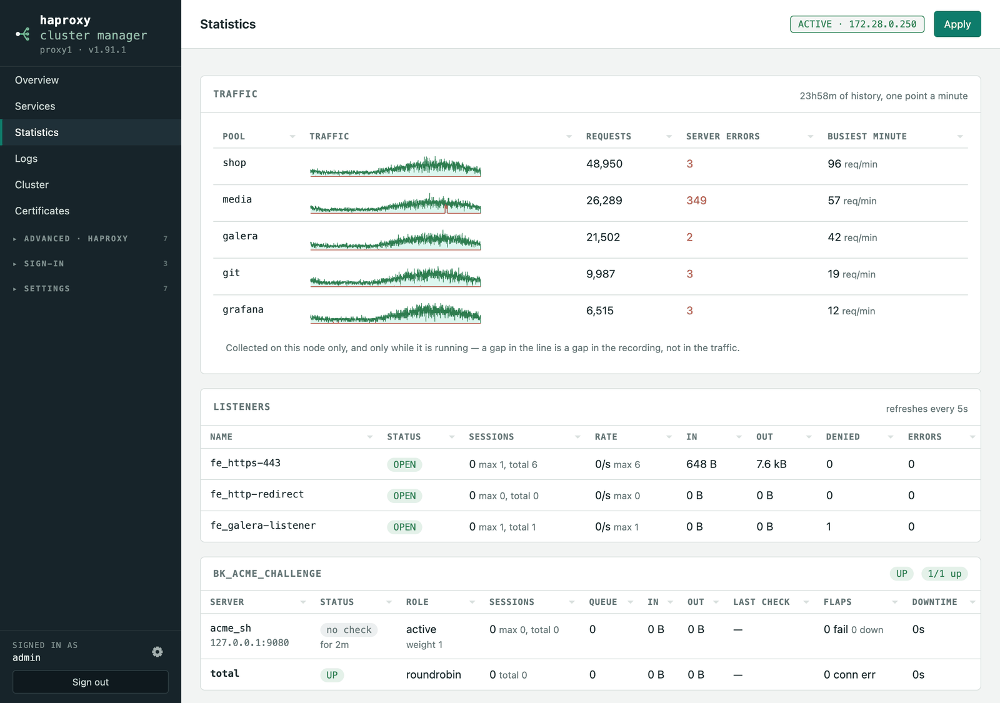

# Statistics & traffic

## Statistics

**Statistics** reads HAProxy's admin socket (`show stat`) and refreshes every
five seconds:

- **Listeners** — status, current/max/total sessions, request rate, bytes in and
  out, denied requests and errors.
- **Each pool** — its own status, how many servers are up, and per server: state
  (UP / DOWN / MAINT / DRAIN / NOLB) with how long it has held it, active or
  backup, weight, sessions, queue, traffic, the last health check result
  (`L7OK`, `L4CON`, …) with its duration, failed-check and flap counts, and
  total downtime.

A server with health checking switched off reports `no check` and counts as up,
because HAProxy still routes to it.

## Traffic history

The Statistics page shows what is happening now; the **Traffic** card on it
shows what happened. Once a minute each node records, per pool, how many
requests it served and how many server errors it returned, and keeps a day of
it — enough to answer *when did this start*, which a live gauge cannot.

The Services page carries the same thing as a sparkline per service, with
server errors drawn over the requests, because the question is always whether
they happened at the same time.

It is per node and only covers time the app was running: a gap in the line is
a gap in the recording, not in the traffic. Counts are per minute rather than
totals, and a counter that goes backwards is treated as HAProxy having
restarted rather than as negative traffic.

**The traffic this app generates itself is not counted.** The once-a-minute
URL probes go through HAProxy on purpose — that is what makes them honest —
so HAProxy counts them like anyone else's requests, and a service nobody
visits would show a steady line of the app talking to itself. The history
subtracts what the probes put through, including the 401 a sign-in answers a
probe with, so zero visitors reads as zero. (HAProxy's backend *health
checks* were never in these numbers — HAProxy accounts for them separately.)

**The charts cannot overstate a trickle.** A sparkline scaled purely to its
own peak turns a flat 1 request a minute into a solid block that reads as
more traffic than a real rush on the row above it. The scale therefore never
drops below 10 requests a minute: a trickle draws as the low band it is, and
anything actually busy still gets its own scale. Server errors are drawn on
the same scale as the requests, for the same reason.
