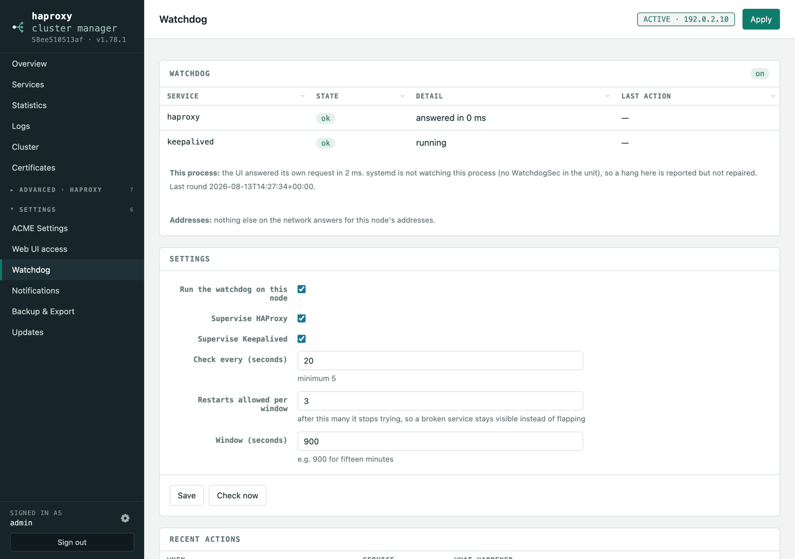

# Watchdog




Each node supervises its own services. **Watchdog** shows what it sees and what
it has done.

The point is the distinction between *stopped* and *hung*. `systemctl is-active`
answers "is the process there", which a wedged process passes while serving
nothing — so each service gets a probe that makes it *do* something:

| Service | Liveness probe | Restarted when |
| --- | --- | --- |
| **HAProxy** | `show info` on its stats socket | the service is stopped or failed, or it does not answer within 5s |
| **Keepalived** | the service is running when the cluster wants it | it is stopped or failed while this node should be running it |
| **This app** | a real HTTP request to its own listener | see below |

It restarts deliberately, not reflexively:

- **Never against a configuration that cannot work.** If `haproxy -c` rejects
  the file, restarting is a loop that hides the fault, so it stops and says
  which line is wrong.
- **Never a service you disabled.** A masked or disabled unit is taken as "leave
  this alone" — a node in maintenance stays in maintenance.
- **Never endlessly.** Three restarts per fifteen minutes by default; after that
  it stops and reports, so a failing service stays visible instead of flapping.
- Everything it does is logged, so the **Logs** page carries the history.

### The published URLs are asked, the way a browser would ask

Every check above looks at a piece: the health checks watch the backend
servers, the watchdog watches the processes, the VRRP tracking script watches
the admin socket. All of them can be green while `https://app.example.com`
answers nobody — DNS pointing at the wrong machine, another host claiming the
address, a listener that lost its certificate. So once a minute, the node
holding the virtual IP requests every published URL exactly as a visitor
would: resolve the name, connect, speak TLS, ask.

Three answers. *It answers* — any HTTP status counts, including the 401 of a
service behind a sign-in, and the 503 of a pool whose servers are down (that
one is already alerted on by the health checks, so the probe stays quiet
about it). *It answers but the certificate does not verify* — expired, the
wrong name, or an issuer this machine does not trust; a visitor would get a
warning page, so this is a warning here. *No answer at all* — including a
name DNS cannot resolve, which is reported as exactly that. TCP services are
a connection attempt to their port.

Failures show beside the URL on the Services page and go out as
notifications (the *service* event), with what failed and what the name
resolved to. Only changes are reported, and recovery closes the loop.
Turn it off under **Settings → Watchdog** if your names only resolve from
outside your network.

### Two machines using one address

Every few minutes the watchdog asks the network whether anything else answers
for the addresses this node holds — `arping -D`, which asks without claiming,
so a reply can only come from somebody else. If one does, the Watchdog page
says so and a notification goes out.

It is worth checking because it is invisible from every layer above the
network: the address is configured on this node, the socket is listening on
this node, and a client reaches whichever machine won the last ARP exchange.
The symptom is a node that answers from some places and not others, and comes
and goes for no visible reason — which looks like almost anything except two
machines claiming one address. A cluster that deliberately moves addresses
between machines is exactly where it happens.

Nothing here can fix it: one of the two has to stop using the address.

### Watching the app itself

A watchdog inside a process cannot restart that process, so systemd does it. The
unit sets `WatchdogSec=90`, and the app pings systemd **only when a real request
to its own listener succeeds**. That catches the failure that matters: every
worker thread blocked, process healthy, UI answering nothing. Pinging from a
timer would report health from inside a process that serves none.

Verified by stopping the process with `SIGSTOP` — `systemctl is-active` still
said `active`, and systemd restarted it on the deadline:

```
systemd[1]: haproxy-manager.service: Watchdog timeout (limit 1min 30s)!
systemd[1]: haproxy-manager.service: Failed with result 'watchdog'.
systemd[1]: haproxy-manager.service: Scheduled restart job, restart counter is at 1.
```

In Docker there is no systemd: supervisord restarts the app if it *exits*, and
the image's `HEALTHCHECK` reports whether the UI answers, but nothing restarts a
hung container unless your orchestrator acts on that health status.

### Node health is collected here too

The watchdog polls every node on a schedule and keeps the result, so the UI
reads a snapshot instead of asking each node while you wait. The Cluster panel
shows the snapshot's age and has a **Refresh** button for a live round. With one
unresponsive node: **5.1s** to collect, **3ms** to read.

`HAM_CLUSTER_POLL` (15s) sets the collection interval; `HAM_CLUSTER_MAX_AGE`
(60s) is the age beyond which a request collects it inline rather than show
something stale.
